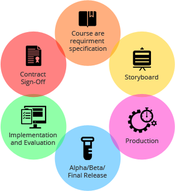

#  6 Stages of Software Development Process

The process of software development services in India goes through a series of stages in step wise fashion that almost every developing company follows. Known as the ‘software development life cycle,’ these six steps include planning, analysis, design, development & implementation, testing & deployment and maintenance. Let’s study each of these steps to know how the perfect software is developed.

---

1. **Planning**: Without the perfect plan, calculating the strengths and weaknesses of the project, development of software is meaningless. Planning kicks off a project flawlessly and affects its progress positively.

2. **Analysis**: This step is about analyzing the performance of the software at various stages and making notes on additional requirements. Analysis is very important to proceed further to the next step.

3. **Design**: Once the analysis is complete, the step of designing takes over, which is basically building the architecture of the project. This step helps remove possible flaws by setting a standard and attempting to stick to it.

4. **Development & Implementation**: The actual task of developing the software starts here with data recording going on in the background. Once the software is developed, the stage of implementation comes in where the product goes through a pilot study to see if it’s functioning properly.

5. **Testing**: The testing stage assesses the software for errors and documents bugs if there are any.

6. **Maintenance**: Once the software passes through all the stages without any issues, it is to undergo a maintenance process wherein it will be maintained and upgraded from time to time to adapt to changes. Almost every software development Indian company follows all the six steps, leading to the reputation that the country enjoys in the software market today

